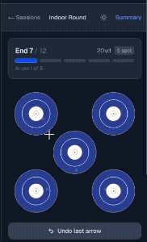
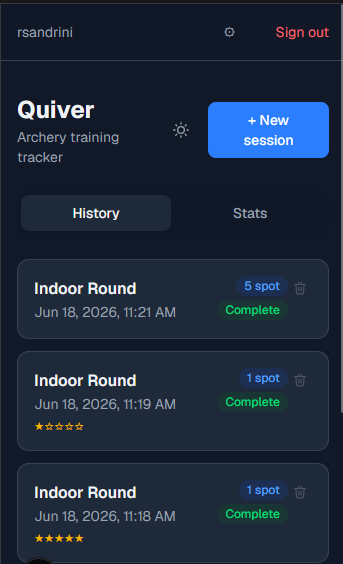
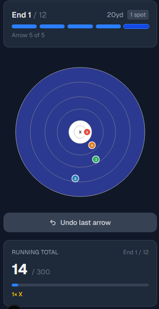
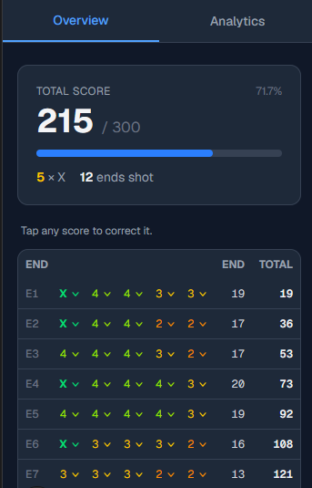
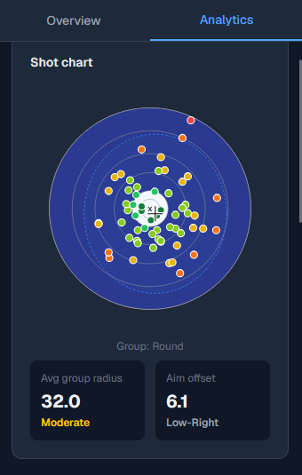
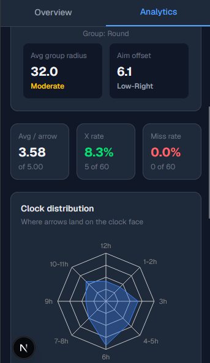
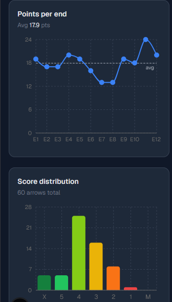
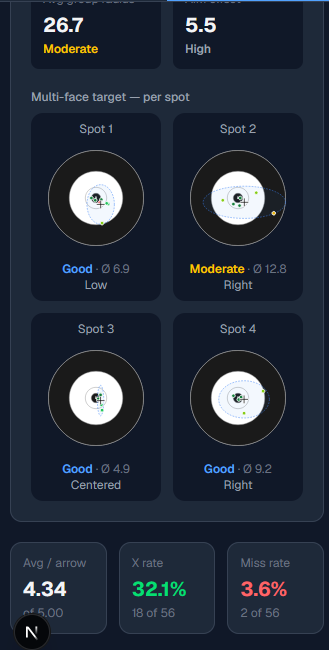

# Quiver

A mobile-first archery training tracker built with Next.js.

Record sessions, track arrow placement on interactive targets, and review your progress over time.

---

## Screenshots

### Recording arrows — Indoor 5-spot


### Sessions list


### Recording arrows — Indoor 1-spot


### Session summary — score table


### Analytics — shot chart & grouping stats


### Analytics — clock distribution & per-arrow stats


### Analytics — points per end & score distribution


### Analytics — multi-face per-spot breakdown


---

## Features

- **Multiple target types** — Indoor 1-spot, Indoor 5-spot, Flint 1-spot, Flint 4-spot
- **Touch-based arrow placement** with zoom overlay for precise positioning
- **Session summary** with shot chart, group radius, aim offset, and per-arrow score table
- **Score editing** — tap any arrow score to correct it inline
- **Session notes** with star rating
- **Dark mode** with theme toggle
- **Authentication** — register, login, settings (name/email/password), forgot password via email

## Tech stack

- [Next.js 15](https://nextjs.org) — App Router, standalone output
- [NextAuth v5](https://authjs.dev) — credentials-based auth
- [Prisma 7](https://prisma.io) — SQLite via better-sqlite3
- [Tailwind CSS](https://tailwindcss.com)
- [Nodemailer](https://nodemailer.com) — Gmail SMTP for password reset emails
- [Docker](https://docker.com) + [Cloudflare Tunnel](https://developers.cloudflare.com/cloudflare-one/connections/connect-networks/) — self-hosted deployment without a fixed IP

## Local development

```bash
npm install
npx prisma migrate dev
npm run dev
```

### Environment variables

```env
DATABASE_URL="file:./dev.db"
AUTH_SECRET=your-secret        # openssl rand -base64 32
AUTH_URL=http://localhost:3000

# Gmail SMTP (for password reset)
SMTP_USER=you@example.com
SMTP_PASS=your-app-password    # Google App Password (requires 2FA)
```

## Self-hosted deployment

The app runs as a Docker container with SQLite persisted on a host volume. A `cloudflared` sidecar handles the Cloudflare Tunnel — no fixed IP or port forwarding required.

### Prerequisites

- Docker + Docker Compose on the host
- A domain managed by Cloudflare
- A Cloudflare Tunnel token (Zero Trust → Networks → Tunnels)

### Setup

1. Clone the repo and create a `.env` file:

```env
DATABASE_URL="file:/app/data/prod.db"
AUTH_SECRET=your-secret              # openssl rand -base64 32
AUTH_URL=https://your.domain.com
SMTP_USER=you@example.com
SMTP_PASS=your-app-password
CLOUDFLARE_TUNNEL_TOKEN=your-token
```

2. Build and start:

```bash
docker compose build
docker compose up -d
```

Migrations run automatically on startup. The app is served via the Cloudflare Tunnel at the configured domain with a free TLS certificate.

### Updating

```bash
git pull
docker compose build
docker compose up -d --force-recreate app
```
