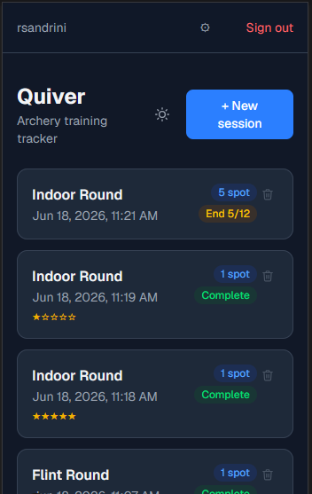
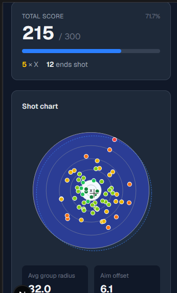
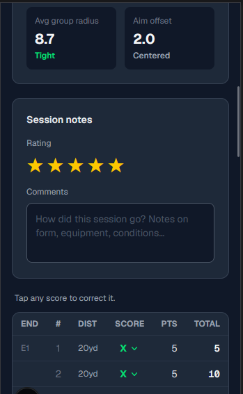
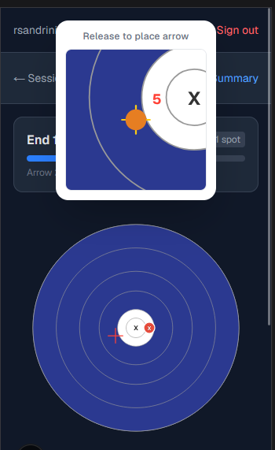
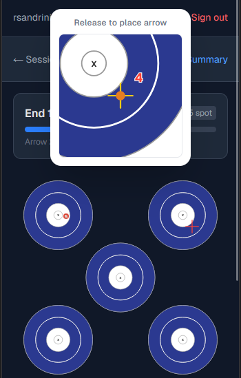

# Quiver

A mobile-first archery training tracker built with Next.js.

Record sessions, track arrow placement on interactive targets, and review your progress over time.

---

## Screenshots

### Sessions list


### Session summary — score & shot chart


### Session summary — stats, notes & arrow table


### Recording arrows — Indoor 1-spot


### Recording arrows — Indoor 5-spot


---

## Features

- **Multiple target types** — Indoor 1-spot, Indoor 5-spot, Flint 1-spot, Flint 4-spot
- **Touch-based arrow placement** with zoom overlay for precise positioning
- **Session summary** with shot chart, group radius, aim offset, and per-arrow score table
- **Score editing** — tap any arrow score to correct it inline
- **Session notes** with star rating
- **Dark mode** with theme toggle
- **Authentication** — register, login, change name/email/password, forgot password

## Tech stack

- [Next.js 15](https://nextjs.org) — App Router
- [NextAuth v5](https://authjs.dev) — credentials-based auth
- [Prisma 7](https://prisma.io) — SQLite via better-sqlite3
- [Tailwind CSS](https://tailwindcss.com)
- [Nodemailer](https://nodemailer.com) — Gmail SMTP for password reset emails

## Getting started

```bash
npm install
npx prisma migrate dev
npm run dev
```

### Environment variables

```env
DATABASE_URL="file:./dev.db"
AUTH_SECRET=your-secret        # openssl rand -base64 32
AUTH_URL=http://localhost:3000

# Gmail SMTP (for password reset)
SMTP_USER=you@example.com
SMTP_PASS=your-app-password
```
